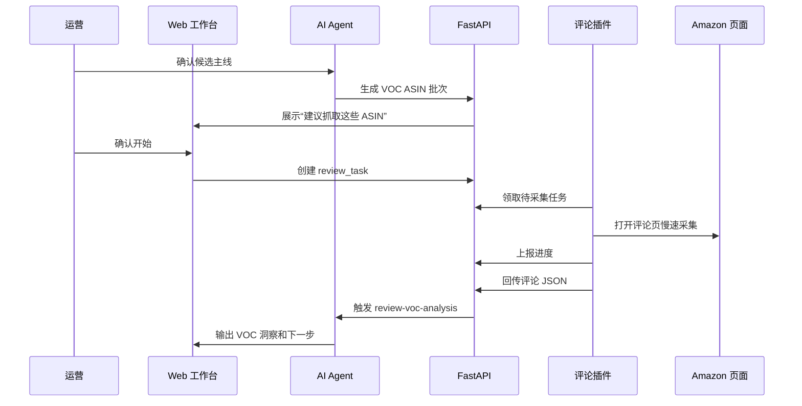

# Web 工作台 Agent 化优化方案

更新日期：2026-06-15

目标形态：运营只和网页里的 AI 对话；AI 读取项目 Skills，按流程判断下一步，必要时调 MCP、要求卖家精灵数据、触发评论插件、暂停等运营决策，最终沉淀正式报告。

## 核心决策

| 决策 | 结论 |
|---|---|
| 模式选择 | 不在网页上让运营手动选。AI 根据对话自动识别 `broad_discovery` / `targeted_deep_dive`，写入 `workflow_state` |
| Skills | 由后端加载项目内 `skills/*.md`，不是依赖 Codex/Claude 客户端的 Skill 运行时 |
| MCP | 由后端代理接入 Sorftime MCP，前端只维护数据源配置和展示调用结果 |
| 评论采集 | 走第三档：AI 判断需要 VOC 后，网页创建任务，Chrome 评论插件自动采集并回传 |
| 前端职责 | 主区域是运营和 AI 的正式对话；左侧是流程状态、数据缺口、运营动作和产物入口 |
| 数据持久化 | 先复用当前 JSON 会话落盘跑通闭环；流程稳定后再切 PostgreSQL |

## 目标体验

1. 运营打开工作台，直接输入选品想法。
2. AI 读取 Master Skill，判断当前意图是否清晰。
3. AI 自动识别内部模式：
   - 模糊意图：进入无方向探索。
   - 明确方向：进入指定方向深挖。
   - 信息不足：每次只追问一个关键问题。
4. AI 判断是否调 Sorftime MCP：
   - 模糊方向：用 MCP 辅助拆方向、看趋势和关键词量级。
   - 明确方向：先快验是否值得继续，再让运营导卖家精灵。
5. AI 判断何时需要运营动作：
   - 上传卖家精灵导出。
   - 确认主线/边界/排除项。
   - 确认评论采集 ASIN 批次。
   - 补利润/合规模板。
6. 候选池确认后，AI 自动创建评论采集建议。
7. 运营确认后，评论插件采集并回传评论。
8. AI 使用 `review-voc-analysis` Skill 分析 VOC。
9. 数据齐全后生成最终报告。

## 后端能力分层

| 层 | 作用 | 主要位置 |
|---|---|---|
| Skill Loader | 读取 `skills/*.md` 和必要参考文档 | 待新增：`server/skills/` |
| Prompt Builder | 组合 Master Skill、阶段 Skill、workflow_state、工具说明 | 待新增：`server/prompting/` |
| Agent Loop | 大模型 tool-use 循环，决定调工具或暂停运营 | 已有：`server/llm/loop.py` |
| Tool Registry | 注册本地 pipeline 工具和 MCP 工具 | 已有：`server/tools/registry.py`，待扩展 |
| Workflow State | 保存阶段、内部模式、缺失数据、决策点、证据 | 已有：`packages/research_core/workflows/interactive_workflow.py` |
| Review Task Queue | 管理评论插件采集任务和进度 | 待新增：`server/review_tasks/` |

## Skills 接入方式

后端不直接使用 Codex Skill 运行时，而是把仓库内 Skill 文件作为模型上下文。

| Skill | 加载方式 | 触发条件 |
|---|---|---|
| `skills/amazon-product-research/SKILL.md` | 常驻 Master Skill | 每轮对话 |
| `skills/market-scan/SKILL.md` | 阶段动态追加 | 找方向、候选池、市场扫描、卖家精灵导入 |
| `skills/candidate-deep-dive/SKILL.md` | 阶段动态追加 | 候选主线确认后进入深挖 |
| `skills/review-voc-analysis/SKILL.md` | 阶段动态追加 | 评论任务完成或评论数据已导入 |

参考文档按需追加，不常驻全文塞入：

- `docs/sorftime-mcp-工具调用策略.md`
- `docs/卖家精灵手动导出数据清单.md`
- `docs/分析模式库.md`
- `docs/自有评论插件对接方案.md`

Prompt Builder 输入：

```text
Master Skill
+ 当前阶段 Skill
+ 当前 workflow_state 摘要
+ 已有 artifacts 摘要
+ 可用工具清单
+ 最新用户消息
```

## 模式自动识别

网页不再展示“指定方向深挖 / 无方向探索”卡片。

AI 内部识别规则：

| 用户输入 | 内部模式 |
|---|---|
| “美国站家居清洁小工具”“想找轻小家居品” | `broad_discovery` |
| “窗户刮水器二合一工具”“宠物饮水机” | `targeted_deep_dive` |
| “想做美国站，有没有推荐” | 暂不定模式，先追问禁区/偏好 |

识别结果写入：

```json
{
  "mode": "targeted_deep_dive",
  "stage": "intent_intake",
  "initial_intent": "窗户刮水器二合一工具",
  "site": "US",
  "decision_required": false
}
```

前端只展示“AI 已识别：指定方向深挖”，不要求运营先选模式。

## MCP 接入

MCP 工具由后端接，不由前端直接接。

| 能力 | 说明 |
|---|---|
| 数据源配置 | 前端保存 MCP URL 和 Key 到后端本地配置 |
| MCP Client | 后端连接 Sorftime Streamable HTTP MCP |
| 工具发现 | 启动或测试时调用 `tools/list`，转成可用工具清单 |
| 工具调用 | Agent Loop 按 Skill 规则决定是否调用 |
| 结果保存 | MCP 返回摘要给模型，完整结果存 `session.artifacts` |

第一批建议接入工具：

| 场景 | Sorftime 工具 |
|---|---|
| 类目定位 | `category_search_from_product_name` |
| Top100 快验 | `category_report` |
| 关键词快验 | `keyword_detail` |
| 1688 粗估成本 | `ali1688_similar_product` |

MCP 调用必须记录：

- 工具名
- 参数
- 调用时间
- 消耗积分估算
- 结果摘要
- 是否进入报告证据链

## 评论插件第三档整合

目标：AI 判断需要 VOC 时，自动创建评论采集任务；插件领取任务、采集、回传；AI 自动分析。



### 评论任务状态

| 状态 | 含义 |
|---|---|
| `draft` | AI 生成建议，等运营确认 |
| `queued` | 已确认，等插件领取 |
| `running` | 插件正在采集 |
| `paused_login` | Amazon 需要登录 |
| `paused_captcha` | 遇到验证码/验证页 |
| `completed` | 评论已回传 |
| `failed` | 采集失败 |
| `analyzed` | VOC 分析完成 |

### 后端接口草案

| 接口 | 调用方 | 作用 |
|---|---|---|
| `POST /api/sessions/{session_id}/review-tasks` | Web/AI | 创建评论采集任务 |
| `GET /api/review-tasks/pending` | 插件 | 领取待执行任务 |
| `POST /api/review-tasks/{task_id}/claim` | 插件 | 锁定任务 |
| `POST /api/review-tasks/{task_id}/progress` | 插件 | 回传当前 ASIN、站点、条数、状态 |
| `POST /api/review-tasks/{task_id}/reviews` | 插件 | 回传评论 JSON |
| `POST /api/review-tasks/{task_id}/analyze` | 后端/AI | 触发 VOC Skill 分析 |

### 评论数据入口

插件回传 JSON 后，后端转换为 `review_voc_package`，复用现有链路：

- `scripts/build_review_voc_from_plugin_export.py` 的字段映射逻辑需要下沉到 `packages/research_core/pipeline/`
- Excel 文件导入保留为 fallback
- HTML AI 报告只作为人读参考，不作为强证据主来源

## 前端调整

| 区域 | 调整 |
|---|---|
| 主对话区 | 始终是正式运营和 AI 对话；支持 `Enter` 换行，`⌘/Ctrl+Enter` 发送 |
| 左侧流程栏 | 展示阶段、内部模式、站点、缺失数据、下一步动作 |
| 模式卡片 | 删除，不再让运营手动选择 |
| 数据源配置 | 保留 AI 配置和 Sorftime MCP 配置分离 |
| 评论任务卡 | 新增 ASIN 批次、插件状态、已采集条数、暂停原因 |
| 报告产物 | 展示候选池、VOC 包、深挖包、正式报告下载 |

## 落地阶段

| 阶段 | 目标 | 验收 |
|---|---|---|
| P0 | 删除前端模式选择，改为 AI 自动识别模式 | 运营输入一句话后，`workflow_state.mode` 自动确定或追问 |
| P1 | Skill Loader + Prompt Builder | 后端每轮对话可加载 Master Skill 和阶段 Skill |
| P2 | Sorftime MCP 工具化 | AI 可按 Skill 调用 MCP，并把结果存入会话 |
| P3 | 评论任务队列 | 网页可创建任务，插件可领取并上报状态 |
| P4 | 插件回传评论 + VOC 分析 | 评论自动进入 `review-voc-analysis`，生成 VOC 产物 |
| P5 | 报告闭环 | 最终报告包含交互决策、MCP 证据和评论 VOC 证据 |

## 边界和风险

| 风险 | 处理 |
|---|---|
| 前端暴露 Key | Key 只保存后端，前端只显示脱敏状态 |
| MCP 积分浪费 | Skill 约束调用时机；后端记录工具调用和积分估算 |
| Amazon 登录/验证码 | 插件检测后暂停，必须运营处理，不绕过验证 |
| 插件和网页跨项目通信 | 用后端 HTTP 接口，不读取 Chrome Storage |
| 评论样本不足 | AI 只能输出 Wait/补抓建议，不能强 Go |
| 数据过多塞爆上下文 | 工具返回摘要，完整 JSON 存 artifacts，按需引用 |

## 需要改的主要位置

| 模块 | 文件/目录 |
|---|---|
| 后端 Skill Loader | `server/skills/` |
| Prompt Builder | `server/prompting/` |
| MCP 工具注册 | `server/tools/registry.py`、`server/data_sources/` |
| 会话状态 | `server/sessions/store.py`、`packages/research_core/workflows/interactive_workflow.py` |
| 评论任务 | `server/review_tasks/`、`server/app.py` |
| 前端工作台 | `webapp/app/page.tsx`、`webapp/components/StateCard.tsx` |
| 评论任务卡 | 待新增：`webapp/components/ReviewTaskCard.tsx` |
| 评论插件 | `/Users/sxie/Documents/亚马逊/amz-review-harvester/background.js`、`popup.js`、`manifest.json` |
