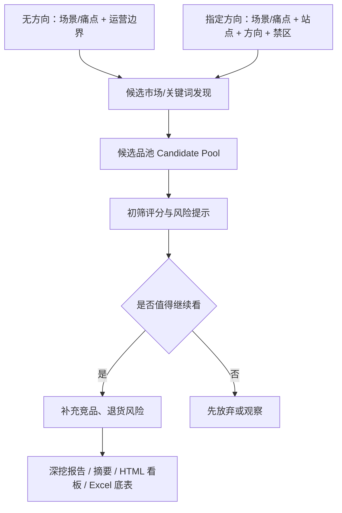

# 选品系统方向锚点

更新日期：2026-06-11

## 一句话方向

这不是“输入一个产品，生成一份报告”的工具。

这是“输入模糊选品意图或市场大盘数据，系统主动发现候选方向，再逐层筛选、深挖、生成报告和看板”的选品系统。

## 不能偏的规则

| 规则 | 含义 |
|---|---|
| 初始入口不是具体产品 | 运营一开始可能只有大概方向，甚至没有明确品类 |
| 系统要主动发现候选品 | 不是让运营先找好品，再让系统整理材料 |
| 先候选池，后深挖报告 | 报告是筛选后的产物，不是第一步 |
| 风险先提示，不强裁决 | 退货风险先做早期提示和待复核项 |
| 数据必须可追溯 | 强判断必须能回到卖家精灵导出文件、MCP 返回、人工输入或计算公式 |
| 真实可用优先 | 报告必须基于真实导入数据给中肯建议；页面视觉只服务判断，不能用花哨展示替代证据和结论 |

## 初始输入

第一步只收集选品边界。

| 字段 | 是否必填 | 示例 |
|---|---|---|
| 场景/痛点 | 必填 | 免手持跑步、双狗防缠绕、夜跑安全、户外解放双手 |
| 站点 | 必填 | US、CA、UK |
| 大概方向 | 可选 | 户外、家居、宠物、厨房，也可以为空 |
| 明确不做 | 必填 | 儿童、医疗、强认证、侵权高风险、大件、易碎 |
| 偏好条件 | 可选 | 轻小、非强季节、10 美金以上、近半年新品有机会 |
| 运营假设 | 可选 | 想找高复购、低退货、可差异化的产品方向 |

初始阶段不要求：

- 具体 ASIN
- 明确产品方案
- 最终售价

## 系统流程

## 候选品池应包含什么

| 模块 | 看什么 |
|---|---|
| 候选方向 | 系统发现的产品方向、关键词方向、细分类目方向 |
| 出现原因 | 为什么这个方向被推荐进入候选池 |
| 需求证据 | 搜索量、趋势、Top100 表现、销售额、BSR |
| 竞争结构 | 品牌集中度、卖家集中度、评论门槛、价格带 |
| 新品机会 | 近半年上架且有一定销量的 ASIN |
| 退货风险 | 类目退货率、评论结构性问题线索 |
| 状态 | 继续看、试做、观察、先放弃 |
| 缺失数据 | 进入下一步前需要补什么 |

## 重点候选深挖标准

候选方向进入“继续看/试做”后，才跑正式深挖。正式深挖吸收开源 Skill 里值得保留的质量规则。

| 规则 | 要求 |
|---|---|
| Top100 完整 | 正式报告不能只取代表样本，Top100 明细必须完整 |
| 基础属性打标 | Top100 至少按功能、规格、形态、价格带、使用场景等维度打标 |
| 交叉分析 | 对关键属性做组合分析，找供需缺口和伪空白 |
| 结论回表 | 报告里的表格、统计和强判断，必须能回到 Excel Sheet 或原始来源 |
| 完整性检查 | 每个阶段结束前检查缺失、重复、异常和低置信度字段 |
| 变体处理 | 多 SKU/变体链接要标记统计口径，避免把单个子体表现误算成整个父体表现 |
| 洞察解释 | 不能只堆数据，每个重要表格后要写业务含义、风险和下一步 |

## 双源数据分工

V1 采用双源融合，各司其职：

| 数据源 | 最适合做什么 | 不适合替代什么 |
|---|---|---|
| 卖家精灵手动导入 | 大盘扫描、Top100 完整明细、市场分析、ABA、退货率、批量铺底 | 实时趋势验证、竞品流量词、延展品发现 |
| Sorftime MCP | 类目趋势、关键词趋势/CPC/旺季、竞品流量词、相似品/潜力品、候选方向深度验证 | 大盘初扫、完整 Top100、ABA 详细数据 |

Sorftime `product_reviews` 只有近 1 年最多 100 条，不足以做深度 VOC，评论证据链仍由自有插件承担。

## 卖家精灵 + Sorftime 数据什么时候需要

真实选品从”模糊意图”进入”候选品发现”时，就需要市场数据。V1 双源并行：卖家精灵做广域铺底，Sorftime MCP 做深度验证。

卖家精灵数据目标用途（手动导出）：

- 找候选市场和关键词
- 拉 Top100 商品池完整明细
- 找近半年上架且有销量的 ASIN
- 看价格带、销量、销售额、BSR、评论门槛
- 看品牌/卖家集中度
- 看关键词趋势、CPC、ABA 等参考
- 看类目退货率

Sorftime MCP 目标用途（V1 已接入）：

- `search_categories_broadly`：无方向探索时辅助找类目入口
- `category_trend`：判断类目是增长/衰退/季节波动/集中度变化
- `keyword_detail` / `keyword_trend`：验证搜索量、CPC、旺季、竞品数量，与卖家精灵双源交叉
- `product_traffic_terms` / `competitor_product_keywords`：看竞品靠哪些词拿流量
- `similar_product` / `potential_product`：候选方向确认后向周边延展找机会品
- `similar_product_feature`：分析同类热销品共性特征（消耗 5 积分，只在候选确认后调用）

详细调用策略见 `docs/sorftime-mcp-工具调用策略.md`。

## 评论插件什么时候接

评论插件不放在第一步。

只有候选品进入“继续看/试做”后，才从候选池里挑一批 ASIN（通常 10-20 个，优先 Top10 标杆、新品和争议竞品），用评论插件导出 Excel 和 HTML AI 报告，再做：

- VOC 痛点
- 结构性问题
- 改品机会
- 图片/A+方向
- 差评反证

## 正确和错误入口

| 入口 | 判断 |
|---|---|
| 无明确方向，只给场景/痛点、站点、禁区和卖家精灵选市场 200 条 | 正确 |
| 输入场景/痛点、站点、方向、禁区、偏好，让系统找候选品 | 正确 |
| 输入一个具体产品，再让系统写调研报告 | 只适合深挖阶段，不适合选品入口 |
| 没有真实市场数据，只生成漂亮报告 | 错误 |
| 先产出候选品池，再对重点候选生成报告 | 正确 |

## 两种探索模式

| 模式 | 适用场景 | 第一步需要什么 | 第一轮输出 | 下一步 |
|---|---|---|---|---|
| 无方向探索 | 运营还没有具体品类，只想找机会 | 站点、禁区、偏好 + 卖家精灵 `选市场 200 条` | 3-5 个候选市场/类目方向，含推荐理由、风险和待补数据 | 运营选 1-3 个方向 → 用 Sorftime `category_trend` 验证趋势，再补 Top100、关键词/ABA |
| 指定方向深挖 | 运营已有大概方向 | 站点、方向、禁区、偏好 + AI 给出的 2-3 个精准关键词 | 候选边界、主线/旁支/混池、建议导出清单 | 导出市场分析、搜索结果/Top100、关键词/ABA → Sorftime 补关键词趋势、竞品流量词、相似品延展 → 评论 VOC |

无方向探索不是让 AI 凭空推荐，而是先用 `选市场 200 条` 做市场级初筛，Sorftime `search_categories_broadly` 辅助找更多类目候选。指定方向深挖才需要运营和 AI 一起收敛关键词，Sorftime 做趋势和竞品词的双源验证。

## V1 最小闭环

V1 不做完整应用，但必须按正确方向搭：

1. 输入 `selection_brief.json`。
2. 接卖家精灵手动导出的 Excel/CSV 或整理表（广域候选池铺底）。
3. 调用 Sorftime MCP 做类目/关键词/竞品深度验证（详见工具调用策略）。
4. 生成候选品池（融合双源数据）。
5. 对候选方向做初筛和缺失项提示。
6. 对值得继续看的候选品生成 `research_package.json`。
7. 正式深挖时完成 Top100 完整明细、基础属性打标、交叉分析和数据质量检查。
8. 输出 `data.xlsx`、`report.md`、`report.html`。

V1 的核心验收不是”能不能写报告”，而是”能不能从模糊意图发现一批值得运营继续看的候选品”。
