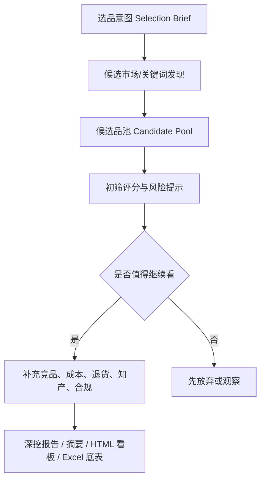

# 选品系统方向锚点

更新日期：2026-06-07

## 一句话方向

这不是“输入一个产品，生成一份报告”的工具。

这是“输入模糊选品意图，系统主动发现候选品，再逐层筛选、深挖、生成报告和看板”的选品系统。

## 不能偏的规则

| 规则 | 含义 |
|---|---|
| 初始入口不是具体产品 | 运营一开始可能只有大概方向，甚至没有明确品类 |
| 初始入口不问成本和物流 | 采购价、FBA、头程、入库配置费只在候选品进入利润复核后再补 |
| 系统要主动发现候选品 | 不是让运营先找好品，再让系统整理材料 |
| 先候选池，后深挖报告 | 报告是筛选后的产物，不是第一步 |
| 风险先提示，不强裁决 | 退货、知产、合规先做早期风险提示和待复核项 |
| 数据必须可追溯 | 强判断必须能回到 MCP、导入数据、人工输入或计算公式 |

## 初始输入

第一步只收集选品边界。

| 字段 | 是否必填 | 示例 |
|---|---|---|
| 站点 | 必填 | US、CA、UK |
| 大概方向 | 可选 | 户外、家居、宠物、厨房，也可以为空 |
| 明确不做 | 必填 | 儿童、医疗、强认证、侵权高风险、大件、易碎 |
| 偏好条件 | 可选 | 轻小、非强季节、10 美金以上、近半年新品有机会 |
| 供应链优势 | 可选 | 塑料、五金、布艺、收纳、户外、宠物用品 |
| 运营假设 | 可选 | 想找高复购、低退货、可差异化的产品方向 |

初始阶段不要求：

- 采购价
- FBA 费用
- 头程费用
- 入库配置费
- 具体 ASIN
- 明确产品方案
- 最终售价

## 系统流程

## 候选品池应包含什么

| 模块 | 看什么 |
|---|---|
| 候选方向 | 系统发现的产品方向、关键词方向、细分类目方向 |
| 出现原因 | 为什么这个方向被推荐进入候选池 |
| 需求证据 | 搜索量、趋势、Top100 表现、销售额、BSR |
| 竞争结构 | 品牌集中度、卖家集中度、评论门槛、价格带 |
| 新品机会 | 近半年上架且有一定销量的 ASIN |
| 初步利润空间 | 只用价格带、体积重量、类目费率做粗判断，不做最终利润 |
| 退货风险 | 类目退货率、评论结构性问题线索 |
| 知产/合规风险 | 商标、专利、认证、产品属性触发项 |
| 状态 | 继续看、试做、观察、先放弃 |
| 缺失数据 | 进入下一步前需要补什么 |

## 重点候选深挖标准

候选方向进入“继续看/试做”后，才跑正式深挖。正式深挖吸收开源 Skill 里值得保留的质量规则。

| 规则 | 要求 |
|---|---|
| Top100 完整 | 正式报告不能只取代表样本，Top100 明细必须完整 |
| 基础属性打标 | Top100 至少按功能、规格、形态、价格带、使用场景等维度打标 |
| 交叉分析 | 对关键属性做组合分析，找供需缺口和伪空白 |
| 结论回表 | 报告里的表格、统计和强判断，必须能回到 Excel Sheet 或原始来源 |
| 完整性检查 | 每个阶段结束前检查缺失、重复、异常和低置信度字段 |
| 变体处理 | 多 SKU/变体链接要标记统计口径，避免把单个子体表现误算成整个父体表现 |
| 洞察解释 | 不能只堆数据，每个重要表格后要写业务含义、风险和下一步 |

## 成本字段什么时候出现

| 阶段 | 是否需要成本 | 原因 |
|---|---|---|
| 选品意图 | 不需要 | 还没确定候选品 |
| 候选品发现 | 不需要 | 先看市场和机会 |
| 候选池初筛 | 只做粗略利润空间提示 | 可用价格带、尺寸重量、类目经验粗看 |
| 继续看/试做 | 需要补 | 这时才补采购价、FBA、头程、入库配置费 |
| 深挖报告 | 需要 | 报告里给两层 FBA 毛利和毛利率 |

## MCP 什么时候需要

真实选品从“模糊意图”进入“候选品发现”时，就需要卖家精灵 MCP 或卖家精灵导出的数据。

MCP 目标用途：

- 找候选市场和关键词
- 拉 Top100 商品池
- 找近半年上架且有销量的 ASIN
- 看价格带、销量、销售额、BSR、评论门槛
- 看品牌/卖家集中度
- 看关键词趋势、CPC、ABA 等参考
- 看类目退货率
- 做商标和部分风险线索初筛

没有 MCP 或导入数据时，只能做流程 mock 和报告样式验证，不能算真正自动选品。

## 评论插件什么时候接

评论插件不放在第一步。

只有候选品进入“继续看/试做”后，才选择 3-5 个核心 ASIN，用评论插件导出 Excel 和 HTML AI 报告，再做：

- VOC 痛点
- 结构性问题
- 改品机会
- 图片/A+方向
- 差评反证

## 正确和错误入口

| 入口 | 判断 |
|---|---|
| 输入站点、方向、禁区、偏好，让系统找候选品 | 正确 |
| 输入一个具体产品，再让系统写调研报告 | 只适合深挖阶段，不适合选品入口 |
| 一开始就让运营填采购价、FBA、头程 | 错误 |
| 候选品进入继续看后，再补成本和物流 | 正确 |
| 没有真实市场数据，只生成漂亮报告 | 错误 |
| 先产出候选品池，再对重点候选生成报告 | 正确 |

## V1 最小闭环

V1 不做完整应用，但必须按正确方向搭：

1. 输入 `selection_brief.json`。
2. 接卖家精灵 MCP 或导入卖家精灵数据。
3. 生成候选品池。
4. 对候选方向做初筛和缺失项提示。
5. 对值得继续看的候选品生成 `research_package.json`。
6. 正式深挖时完成 Top100 完整明细、基础属性打标、交叉分析和数据质量检查。
7. 输出 `data.xlsx`、`report.md`、`summary.md`、`dashboard.html`。

V1 的核心验收不是“能不能写报告”，而是“能不能从模糊意图发现一批值得运营继续看的候选品”。
